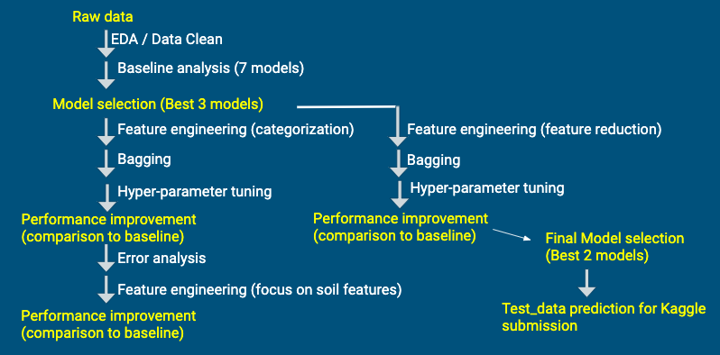

# Forest-Cover-Prediction
Machine learning-based forest resource management

#### Project Team: Adam Sohn, Curtis Lin, Erik Hou, Chloe Wu

---------------

### Motivation

- In the United States, forests occupy approximately 740 million acres, about one third of the country's total land area. Forests support wildlife living among the trees, such as foxes, deer, coyotes, bats, hawks, bears, woodpeckers, many migratory birds etc.. Therefore, it is important to develop an method to effectively monitor and manage the forest changes. Here, we are developing an machine learning-based forest resource management which help improve forest productivity, increases bio-diversity, and protects wildlife.
### Objective
- The objective of this project is to establish a machine learning algorithm to effectively and accurately predict the forest canopy cover type by using cartographic variables only. The seed information for this project is a dataset provided by the US Forest Service (USFS) Region 2 Resource Information System.

### Dataset

- https://www.kaggle.com/c/forest-cover-type-prediction

- The seed information for this project is a dataset provided by the US Forest Service (USFS) Region 2 Resource Information System. The dataset describes 30x30 meter cells in four wilderness areas located in the Roosevelt National Forest of northern Colorado. These areas represent forests with minimal human-caused disturbances, so that existing forest cover types are more a result of ecological processes rather than forest management practices.

- The dataset contains binary columns of data for qualitative independent variables such as wilderness areas and soil type. The dataset also contains continuous, unscaled, quantitative data to describe independant variables such as elevation and distance from roads.

### Data Analysis Plan

> Models: 
- k-Nearest Neighbor (kNN)
- Gaussian Naive Bayes
- Logistic Regression
- Decision Tree
- Random Forest
- Support Vector Machine (SVM)
- Adaboost with Decision Tree